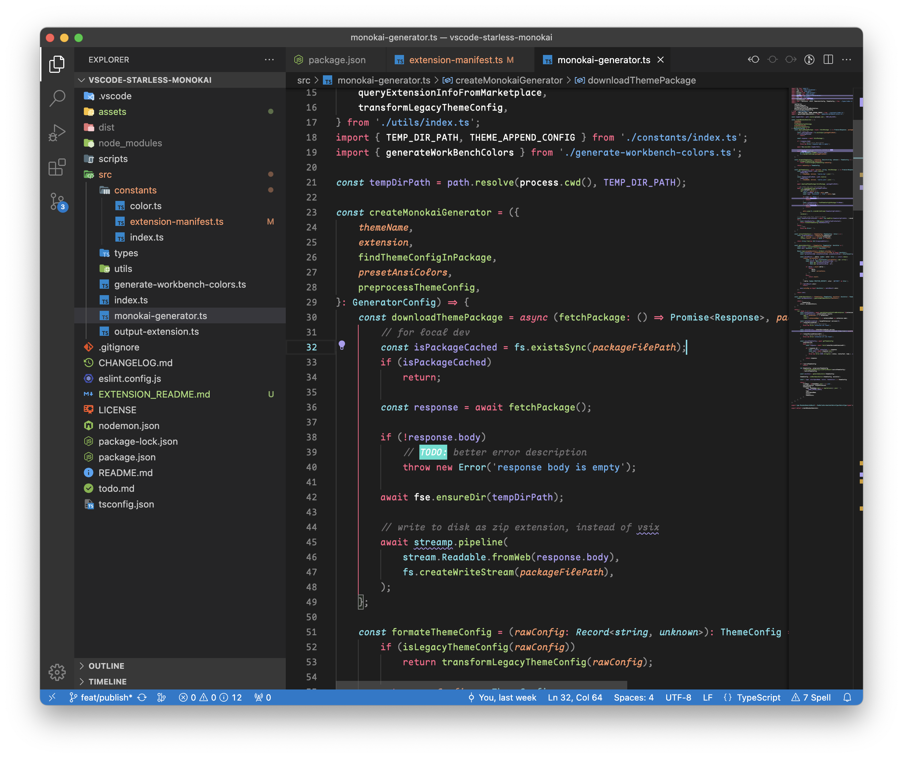

# Starless Monokai

## 🛠️ Develop

### debug extension
refer to [*Debugging the extension*](https://code.visualstudio.com/api/get-started/your-first-extension#debugging-the-extension)

### npm scripts
- `dev`: build ts project, and run node script to generate extension
- `build`: build ts project
- `generate`: run node script to generate extension
- `compile:build-scripts`: compile build scripts by tsc

### dev references
- [Extension API](https://code.visualstudio.com/api)
- [Tasks](https://code.visualstudio.com/docs/editor/tasks)
    - [Schema for tasks.json](https://code.visualstudio.com/docs/editor/tasks-appendix)
    - [background task & prelaunchTask](https://code.visualstudio.com/docs/editor/tasks#_can-a-background-task-be-used-as-a-prelaunchtask-in-launchjson)
    - [Launch.json attributes](https://code.visualstudio.com/docs/editor/debugging#_launchjson-attributes)
- [UX Guidelines](https://code.visualstudio.com/api/ux-guidelines/overview)
- [Theme Color](https://code.visualstudio.com/api/references/theme-color)